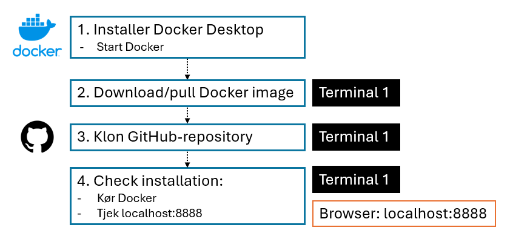
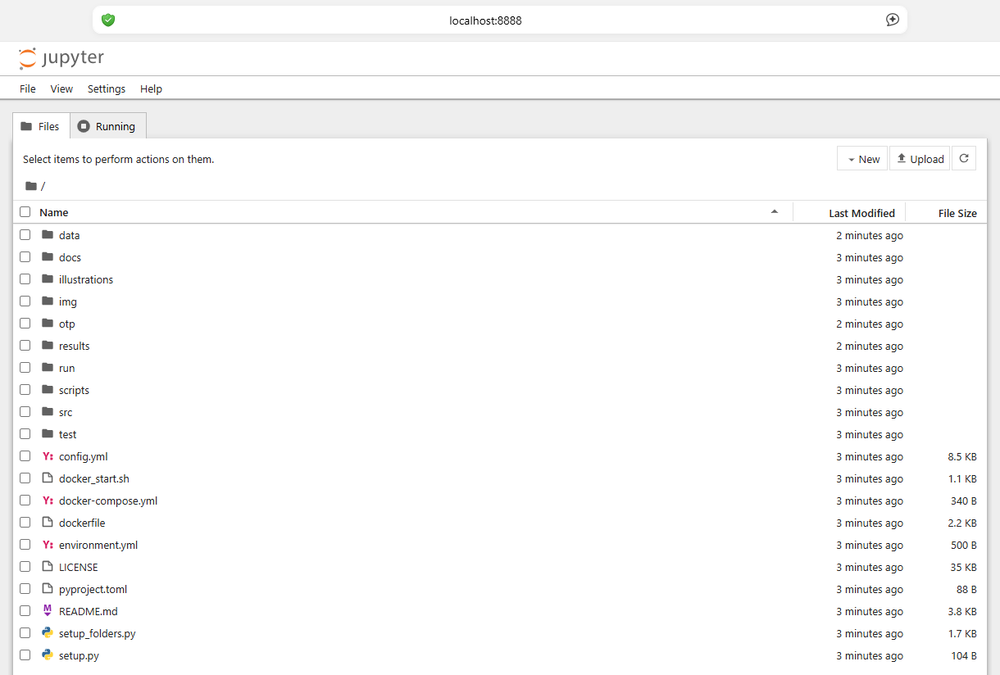
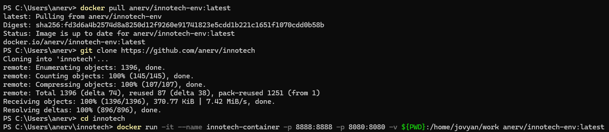
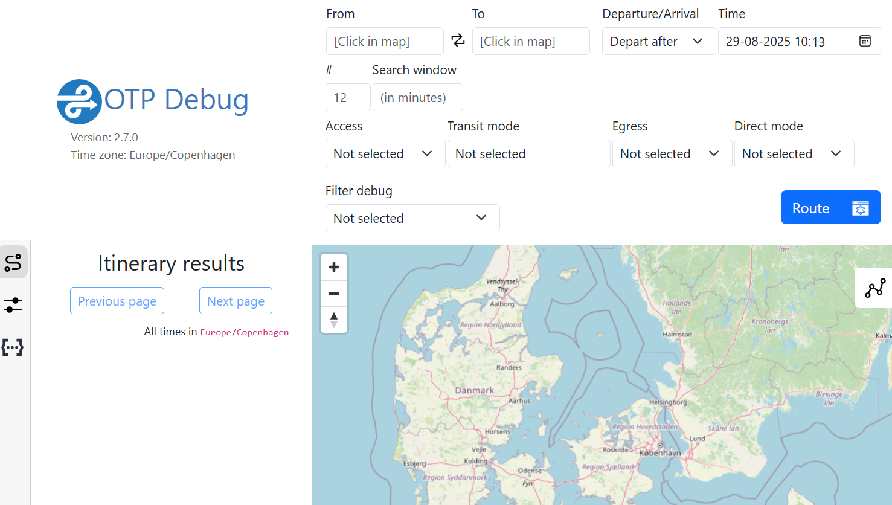

# Installation

Modellen kan *enten* installeres ved hjælp af Docker (metode A) (***anbefalet***) eller manuelt (metode B).
Modellen og installationsvejledningen er udviklet på Windows 11, Intel(R) Core(TM) Ultra 5 125U.

Se ***[LINK TIL RAPPORT]*** for baggrund for projektet og en detaljeret oversigt over datakilder og databehandling.


## A. Installation med Docker :whale2:

> **_OBS:_**  Kræver en installation af [Git](https://git-scm.com/downloads).




#### A1. Installer Docker Desktop

* Installer Docker Desktop fra: https://docs.docker.com/desktop/setup/install/windows-install/
* Start Docker Desktop


#### A2. Download Docker image

* Åbn et terminalvindue (**gerne Docker Desktops indbyggede terminal**) og kør kommadoen:

```bash
docker pull anerv/innotech-env:latest
```

#### A3. Klon GitHub 

* I samme terminalvindue, kør kommandoen:

````bash
git clone https://github.com/anerv/innotech
````


#### A4. Check at installationen var successfuld

* I samme terminalvindue, naviger til hovedmappen (``innotech``):

```bash
cd innotech
```

* Kør Docker containeren:

```bash
docker run -it --name innotech-container -p 8888:8888 -p 8080:8080 -v ${PWD}:/home/jovyan/work anerv/innotech-env:latest
```

* Åben et browservindue og gå til http://localhost:8888/ og bekræft at siden viser Jupyter med indholdet af ```innotech```-mappen.



*Screenshot a Jupyter serveren på localhost:8888 kørt fra innotech-mappen.*

Hvis du kan køre Docker containeren uden problemer og se Jupyter på http://localhost:8888/ er programmet installeret successfuldt.



*Screenshot af terminal hvor Docker image downloades, Github-repository klones, og Docker container startes.*

**For at stoppe Docker og Jupyter:**

* Tast ***CTRL+C*** i din terminal og bekræft med ***'y'*** for at stoppe Jupyter serveren.

* Kør nedenstående for at stoppe Docker containeren:

```bash
docker stop innotech-container
docker rm innotech-container
```


## B. Manuel installation :computer:

Projektet kræver at følgende programmer og værktøjer er installeret:

- *DuckDB*
- *OpenTripPlanner*
- *Osmium*
- *Innotech Conda environment*
- *Python**
- *Jupyter**
- *Conda**
- *pip**
- *git**
- *Java 21**

*Guiden til manuel installation antager at værktøjer markeret med * allerede er installeret.

For at installere de resterende værktøjer køres nedenstående i et terminalvindue:

#### B1. Klon GitHub repository

````bash
git clone https://github.com/anerv/innotech
cd innotech
````

#### B2. Skab Conda environment
```bash
conda create -n innotech geopandas pyyaml pyarrow overpy contextily scikit-learn h3-py python-duckdb ipykernel osmium-tool
```

*ELLER*

```bash
conda env create -f environment.yml
```

#### B3. Aktiver Conda environment og installer sidste elementer
````bash
conda activate innotech
pip install matplotlib-scalebar
pip install --use-pep517 -e .
````

#### B4. Installer DuckDB
````bash
winget install DuckDB.cli
````

#### B5. Installer OpenTripPlanner

Følg instruktionerne for installation af OpenTripPlanner (OTP) her: https://docs.opentripplanner.org/en/dev-2.x/Basic-Tutorial/.

OTP-programmet skal placeres i ``otp``-mappen, eksempelvis:
``innotech/otp/otp-shaded-2.7.0.jar``.

#### B6. Klargør mapper til data og resultater

* Naviger til hovedmappen (``innotech``) i en terminal, hvis du ikke allerede har gjort det: 

```bash
cd innotech
```

* Kør kommandoen:

````bash
python setup_folders.py
````

#### B7. Check at installationen var successfuld

* Tjek at alle ovenstående skridt er gennemført uden fejl.
* Tjek at du i din Python IDE (f.eks. Visual Studio Code) can vælge conda environment ```innotech``` som Python interpreter.
* Tjek at OTP virker:

    - Naviger til undermappen ``otp``:

    ```bash
    cd innotech/otp
    ```

    -  Kør kommandoen:

    ```bash
    java -Xmx2G -jar otp.jar --load .
    ```

    -  Gå til http://localhost:8080/ i din browser for at bekræfte, at OpenTripPlanner er startet korrekt (Når OpenTripPlanner kører kan man tilgå ruteplanlæggeren på http://localhost:8080/).

    - For at stoppe OTP igen, tast **CTRL+C** i din terminal.



*OTP som programmet ser ud i browseren (localhost:8080).*

***


Se [anvendelsesguiden](2_user_guide.md) for instruktioner til at køre analysen.

