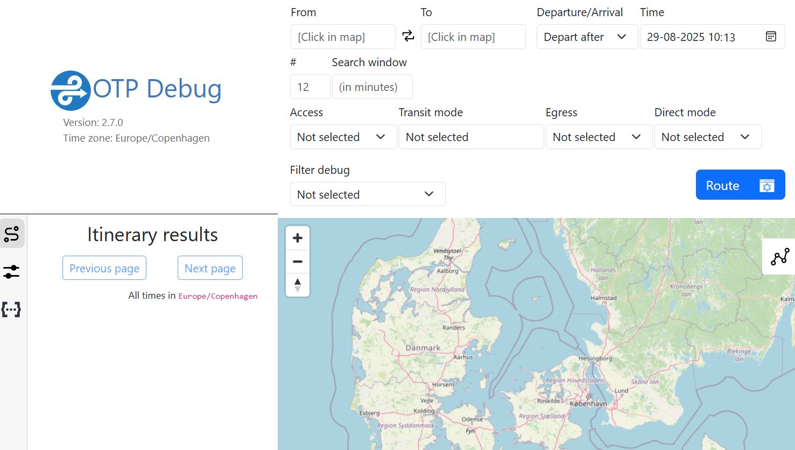

# Anvendelse

## 1. Klargør inputdata :file_folder:

Grundelementerne i tilgængelighedsanalysen er data på husstandsadresser og destinationer samt data på vejnetværket og rejseplansdata for offentlig transport.

### Destinationer og adresser :house:

- Adresse-data fra DAR (adresser, husnumre, og adressepunkter) for den ønskede region.
- BBR-data (enheder) for den ønskede region: 
- CVR-data (produktionsenheder, CVR-enheder med brancher, og CVR-enheder med adresser) for den ønskede region.
- Afgrænsning af studieområdet (data med danske administrative områder (regioner eller kommuner). Opdater config.yml hvis et andet område end Region Sjælland ønskes.). 

Alle data kan downloades fra Datafordeler.dk.

For en oversigt over dataspecifikationer og databehandling, se modelbeskrivelsen her: ***[LINK TIL RAPPORT]***.


### Inputdata til OTP :globe_with_meridians:

- OpenStreetMap: A pbf-file for det pågældende land, downloadet fra eksempelvis https://download.geofabrik.de/.

- NeTEx rejseplansdata: I Danmark kan rejseplansdata i NeTEx-formattet downloades fra det Nationale Access Point: https://du-portal-ui.dataudveksler.app.vd.dk/data/242/overview.


Se nedenstående tabel og ``config.yml`` for forventede filnavne og placeringer.

| Kategori               | Type                 | Navn på dataset i config.yml  | Placering                                                                      |
|------------------------|----------------------|-------------------------------|--------------------------------------------------------------------------------|
|                        | Adresser             | input_address_fp              | *"../data/input/adresser/DAR_V1_Adresse_TotalDownload_csv_Current_256.csv"*    |
| **Adressedata**        | Adressepunkter       | address_points_fp             |*"../data/input/adresser/DAR_V1_Adressepunkt_TotalDownload_csv_Current_256.csv"* |
|                        | Husnumre             | housenumbers_fp               | *"../data/input/adresser/DAR_V1_Husnummer_TotalDownload_csv_Current_256.csv"*  |
| **BBR-data**           | BBR-enheder          | bbr_fp                        | *"../data/input/bbr/BBR_V1_Enhed_TotalDownload_csv_Current_263.csv"*           |
|                        | CVR-adresser         | cvr_address_input_fp          | *"../data/input/cvr/CVR_V1_Adressering_TotalDownload_csv_Current_8.csv"*       |
| **CVR-data**           | CVR-brancher         | cvr_brancher_input_fp         | *"../data/input/cvr/CVR_V1_Branche_TotalDownload_csv_Current_8.csv"*           |
|                        | CVR-penhed           | cvr_penhed_input_fp           | *"../data/input/cvr/CVR_V1_Produktionsenhed_TotalDownload_csv_Current_8.csv"*  |
| **OpenStreetMap**      | OpenStreetmap        | osm_input_pbf                 | *"input/osm/denmark-latest.osm.pbf"*                                           |
| **Regionsinddelinger** | Rergionspolygoner    | -                             | *"../data/input/DAGI10MULTIGEOM_GPKG_HF_20250504080002/regionsinddeling.gpkg"* |
| **Kommuneinddelinger** | Kommunepolygoner     | -                             | *"../data/input/DAGI10MULTIGEOM_GPKG_HF_20250504080002/kommuneinddeling.gpkg"* |
| **Rejseplansdata**     | NeTEx-rejseplansdata | -                             | *"otp/Rejseplanen+NeTEx.zip"*                                                  |


## 2. Opdater indstillinger :pencil2:

> **_NOTE:_** *Ønsker du at køre analysen for Region Sjælland med standardinstillinger kan du springe dette skridt over*.

* ``config.yml`` indeholder bl.a. filnavne og placeringer på inputdata og resultater, navnet på studieområdet, samt indstillinger for, visse destinationer analysen indholder.
Hvis andre destinationer, ankomsttider, inputdata, m.m. ønskes opdateres de her. 

    Brug evt. script ```test/tune_otp_settings.py``` til at teste effekten af ankomsttid m.m.

* ``build-config.json`` indeholder indstillinger for OpenTripPlanner. Opdater kun, hvis studieområdet er i anden anden tidszone end Danmark eller hvis et andet NeTEx-datasæt anvendes.

* Hvis specifikke indstillinger for ruteberegningen ønskes (f.eks. max antal skift, vægtning af ventetid vs. rejsetid, adgang for kørestole etc.) tilføjes en ``router-config.json`` til ``otp``-mappen. Se https://docs.opentripplanner.org/en/latest/RouteRequest/ for eksempel.


Har du fulgt Docker-installationsvejledningen skal du følge vejledning **3A**. Har du fulgt den manuelle installationsvejledning, følg vejledning **3B**.

## 3A. Vejledning hvis du har fulgt Docker-installationen


### 3A.1. Start Docker og kør Docker container

* Start Docker Desktop-applikationen

* Naviger til ```innotech```- mappen:

```bash
cd innotech
```

* Kør Docker container:

```bash
docker run -it --name innotech-container -p 8888:8888 -p 8080:8080 -v ${PWD}:/home/jovyan/work anerv/innotech-env:latest
```


### 3A.2. Generer inputdata :arrows_counterclockwise:

* Åben et browservindue og gå til http://localhost:8888

* Åbn og kør notebook ``A_prepare_data.ipynb`` (i mappen ``/run``).
Denne notebook kører en række sub-scripts der klargør input-data og bygger en ``graph.obj`` fil, der senere anvendes i OpenTripPlanner.

<br>

> **_OBS:_** Husk at anvende Python (innotech) Jupyter Kernel når du kører notebook'en. Det kan være nødvendigt manuelt at vælge den rigtige Jupyter Kernel for hver notebook.


<br>

> **_OBS:_** Der vil muligvis blive printet advarsler om datatyper og diverse statusmeldinger. Så længe der for hvert script printes *"Script XX completed successfully"* og der *ikke* bliver printet, at et script er *"exited with status code 1"* er alt som det skal være.

<br>

### 3A.3. Start OpenTripPlanner

* Åben et nyt terminalvindue (men lad det terminalvindue, hvor du har startet Docker containeren køre).

* I det nye terminalvindue, kør kommandoen:

```bash
docker exec -it innotech-container bash
```

* Naviger til undermappen ``otp``:

```bash
cd otp
```

* Kør kommandoen:

```bash
java -Xmx2G -jar otp.jar --load .
```

* Tjek eventuelt http://localhost:8080/ i din browser for at bekræfte, at OpenTripPlanner er startet korrekt.

<br>


*Først sættes terminalen til at køre inde i Docker containeren, derefter startes OTP.*



*OTP som programmet ser ud i browseren (localhost:8080).*

<br>

### 3A.4. Beregn rejsetider :bus:

* Kør notebook ``B_run_otp.ipynb`` (i mappen ``/run``).

* Efter at notebook B er kørt successfuldt kan resultaterne findes i mappen ``results``: Se [results_overview](results_overview.md) for en oversigt over output fra analysen.

<br>

> **_OBS:_** For et område som Region Sjælland med standard-indstillinger vil det tage 8+ timer at køre analysen på en almindelig laptop (testet på  Windows 11, Intel(R) Core(TM) Ultra 5 125U, 32 GB ram)

<br>

## 3B. Vejledning til manuel installation


### 3B.1. Generer inputdata :arrows_counterclockwise:

* Kør notebook ``A_prepare_data.ipynb`` (i mappen ``/run``).
Denne notebook kører en række sub-scripts der klargør input-data og bygger en ``graph.obj`` fil, der senere anvendes i OpenTripPlanner.

<br>

> **_OBS:_** Husk at vælge conda environment ``innotech`` som Python interpreter når du kører notebook'en. Det kan være nødvendigt at vælge conda environment for hver notebook.

***Valg af Jupyter Kernel vist i Visual Studio Code:***


*Klik først på "Select Kernel".*


*Vælg "innotech (Python)".*

### 3B.2. Start OpenTripPlanner

* Åben et terminalvindue
* Naviger til undermappen ``otp``:

```bash
cd innotech/otp
```

* Kør kommandoen:
```bash
java -Xmx2G -jar otp.jar --load .
```

* Tjek eventuelt http://localhost:8080/ i din browser for at bekræfte, at OpenTripPlanner er startet korrekt.


### 3B.3. Beregn rejsetider :bus:

* Kør notebook ``B_run_otp.ipynb`` (i mappen ``/run``).
* Efter at notebook B er kørt successfuldt kan resultaterne findes i mappen ``results``: Se [results_overview](results_overview.md) for en oversigt over output fra analysen.

> **_OBS:_** For et område som Region Sjælland med standard-indstillinger vil det tage 8+ timer at køre analysen på en almindelig laptop (testet på  Windows 11, Intel(R) Core(TM) Ultra 5 125U, 32 GB ram)


***

## 4. [Valgfrit] Sammenlign datakilder :arrow_right::arrow_left:

- Data på destinationer stammer både fra det danske CVR-register og OpenStreetMap. For en sammenligning af det to datakilder for hver destinationstype, kør notebook ``C00_compare_cvr_osm.ipynb`` (i mappen ``/scripts``). Resultaterne af sammenligningen findes i ``/results/destination_data_evaluation/``.

<br>

***

## Fejlfinding

<br>

> **_OBS:_**  De danske NeTEx-data indeholder ikke rute/rejsetidsdata for færgeforbindelser. Rejsetidsberegninger for ikke-brofaste øer fungerer derfor kun internt på øerne og ikke mellem øer og fastland.

> **_OBS:_**  Hvis OTP returnerer *(StreetIndex.java:405) Couldn't link (10.969541647227851, 55.330497255524456, NaN)* kan det skyldes, at enten start- eller slutadressen ikke kan forbindes til vejnettet og der derfor ikke kan beregnes en rute.

<br>

***